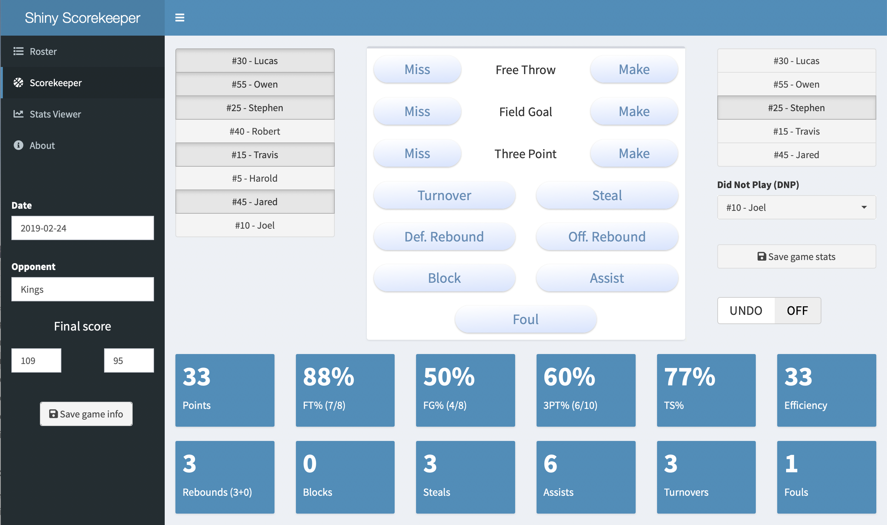

# Shiny Scorekeeper

Shiny Scorekeeper is a basketball scorekeeper app built with the Shiny web framework for R. The app is a hobby project that I took on as a learning exercise. It is likely only of interest to a small subset of people building Shiny apps. 

### Installation

1. Install [R](https://www.r-project.org)
2. Install [RStudio Desktop](https://www.rstudio.com/products/rstudio/download/)
3. Clone or download this repository
4. Open Shiny-Scorekeeper.Rproj
5. Run the following code to install required packages (only needs to be done once)
```
install.packages(c("shiny", "shinydashboard", "shinyWidgets", "shinyjs", "DT", "dplyr", "tidyr"), dependencies = TRUE)
```
6. Run the following code to launch the app
```
shiny::runApp()
```

Instructions for how to use the app are found [here](https://github.com/hinkelman/Shiny-Scorekeeper/blob/master/instructions.md). Background information about the app is found [here](https://github.com/hinkelman/Shiny-Scorekeeper/blob/master/about.md). 


